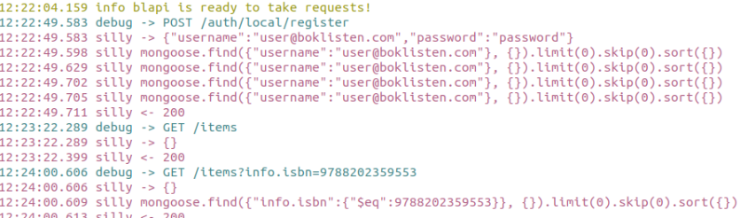

# bl-api

The backend system for boklisten. This readme only describes development,
testing and technical info. For a more deep-dive into what bl-api is, [please
read our documentation](https://github.com/holskil/bl-doc/blob/master/bl-api/summary.md)

- [bl-api](#bl-api)
- [Requirements](#requirements)
- [How to run](#how-to-run)
- [Populating with data](#populating-with-data)
  - [Minimum data for a testing environment](#minimum-data-for-a-testing-environment)
- [Testing](#testing)
- [Terminal output](#terminal-output)
  - [Different log levels shows different output](#different-log-levels-shows-different-output)
- [Stack](#stack)

# Requirements

- [NodeJS v14.0.0 or later](https://nodejs.org)
- [MongoDB v4.0 or later](https://www.mongodb.com)

# How to run

1. Clone this repo to your own computer `$ git clone https://github.com/boklisten/bl-api`
2. Inside the newly created folder do: `$ yarn install`
3. After the installation is done you must create a file `.env` and populate it with the [required environment variables](https://github.com/boklisten/bl-doc/blob/master/bl-api/settings.md).
   - [Read more about .env and dotenv](https://www.npmjs.com/package/dotenv)
4. Ensure that mongodb is running and that you have set `MONGODB_URI` environment variable to the running instance.
5. In the terminal run `$ yarn dev`
6. You will now see a confirmation in the terminal that the application is running
7. The server is by default running on `http://localhost:1337`

# Populating with data

If this is the first time you have ever set up `bl-api` on your system then
the database is empty. To populate the database with some basic data you can do
so manually in the mongo shell or adding it through MongoDB compass. It is also
possible to add the data through `bl-admin`.

### Minimum data for a testing environment

Under is a list of data that is needed in the database for a minimal test environment.

- One user with `admin` permission
  - Can be done by registering a user in `bl-admin` and then editing the `user` object in the database. Change the `permission` field from `customer` to `admin`.
- One branch object in `branches`
  - Fully populated with a `name` and `paymentInformation`
  - Can be done manually or by uploading a excel file through `bl-admin`
- At least one Item in `items`
  - Can be done manually or by uploading a ecel file through `bl-admin`
- At least one BranchItem in `branchitems`.
  - Is done in `bl-admin`

# Testing

The testing is done with `mocha` and `chai`. Test driven development ([TDD](https://en.wikipedia.org/wiki/Test-driven_development)) is easy when the testing is simple to use and fast.

- Run all the tests once:
  - `yarn test`

Every typescript source file `.ts` in `src/` has a corresponding `.spec.ts`
file. This is the unit-test file for that `.ts` file. Example:
`order.patch.hook.ts` has a corresponding `order.patch.hook.spec.ts`. This file
has all the unit-tests for the order patch hook file.

# Terminal output

The terminal is the best place to view status when testing `bl-api`. Under
development you can view every action done to the system by viewing the
terminal output.

## Different log levels shows different output

- `error`
- `warn`
- `info`
  - This is the level the production server is on, only shows bear minumum information, and `error` and `warn` output.
- `verbose`
- `debug`
- `silly`
  - This level is perferred for local development as it shows every log message the system outputs.

# Stack

`bl-api` is a web-server database handler. It is a nodeJS applicatin build on top of `express` and `MongoDB`.

- Express
- MongoDB
- NodeJS
